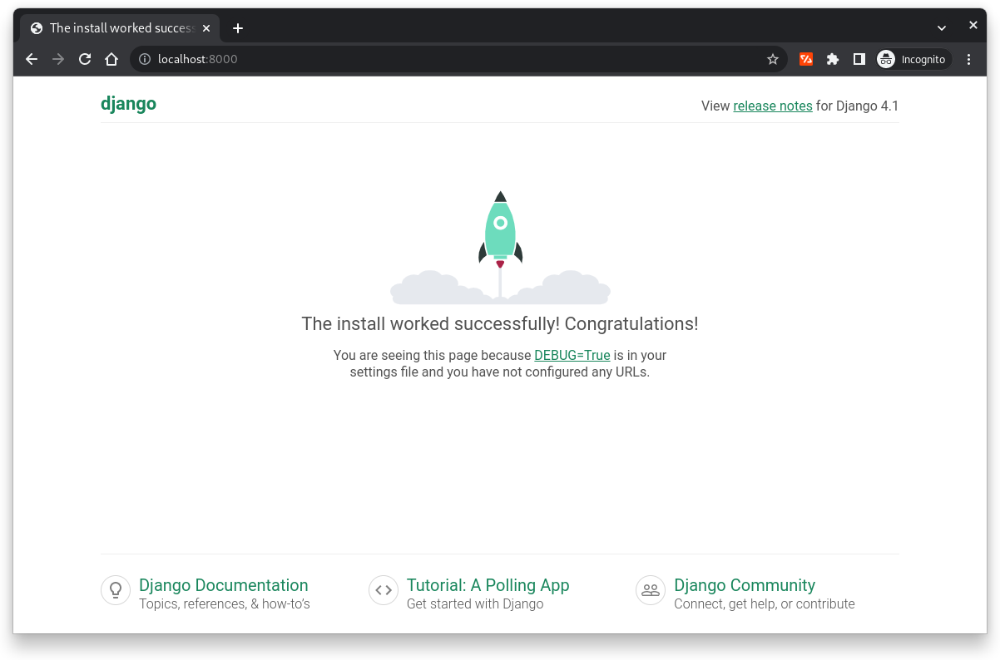
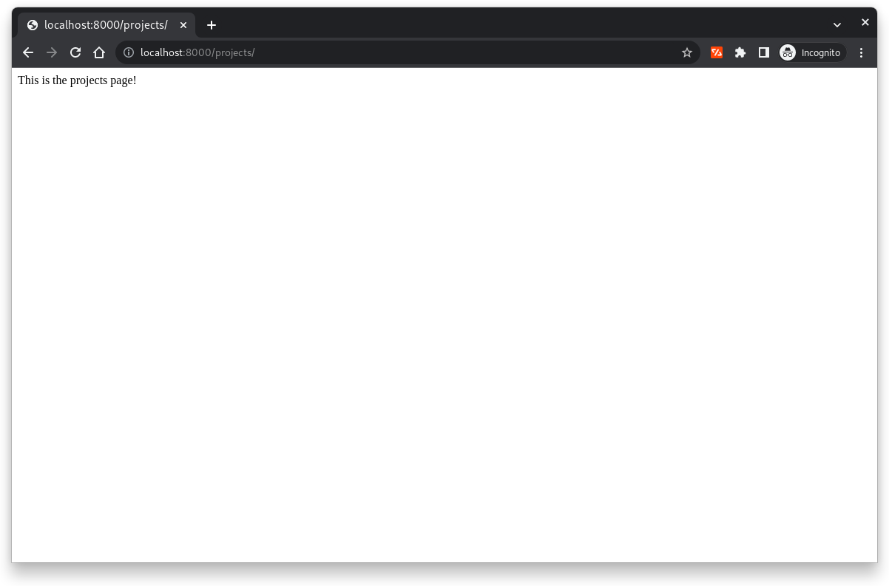
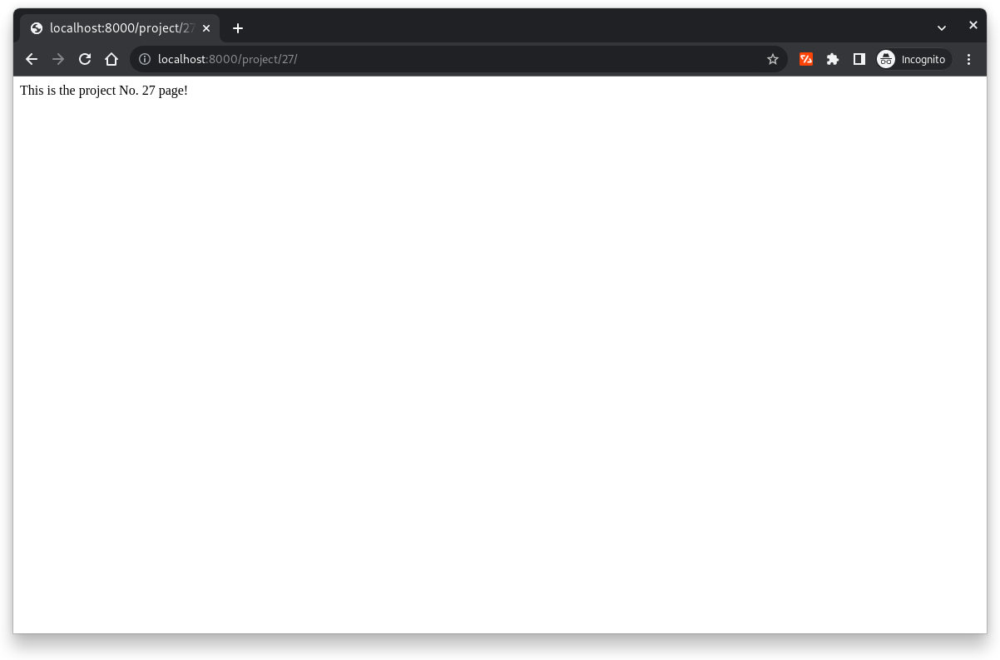
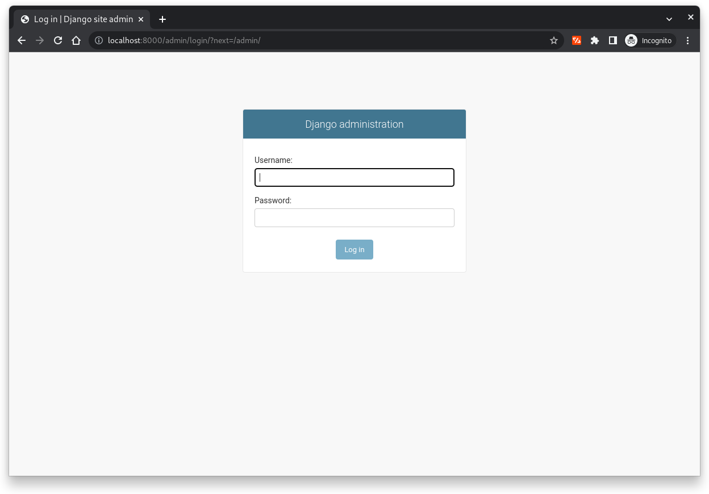
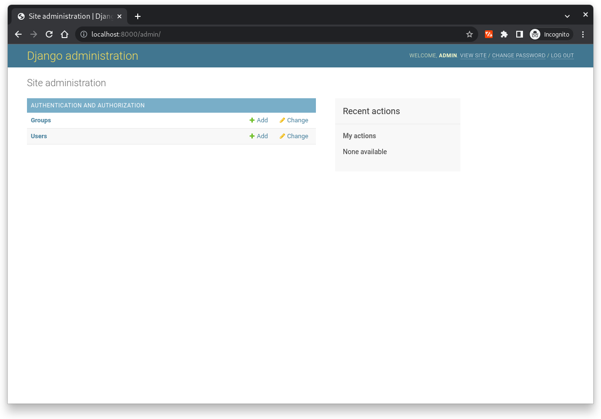
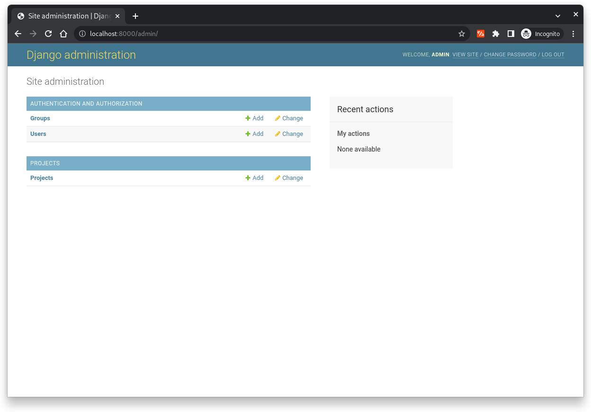
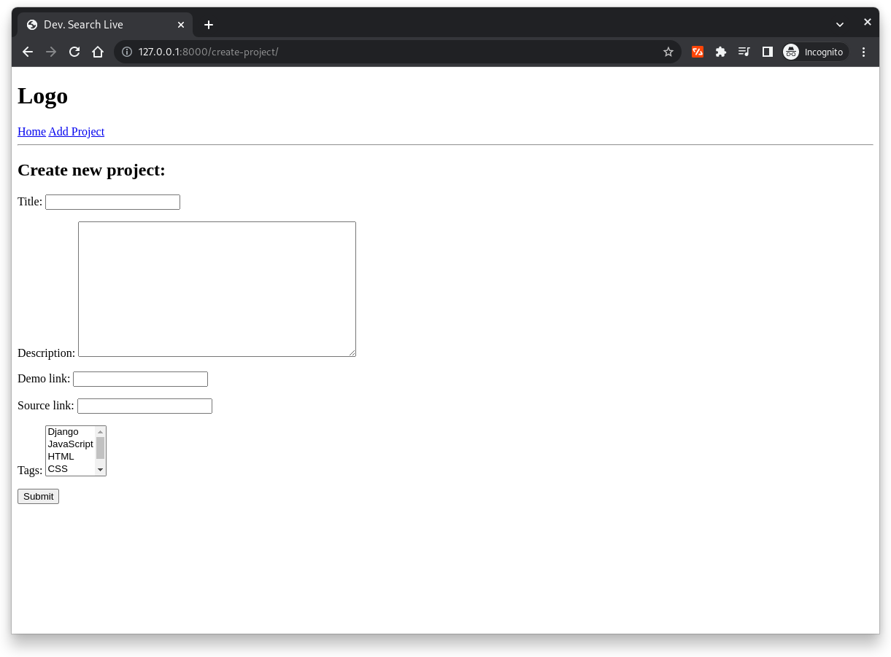

# Python Django 2021 Bootcamp Course Sessions

## Course Content

- Session #1: Views, URLs & Templates
- Session #2: Admin Panel, Models & Database Queries
- Session #3: Models Forms & CRUD
- Session #4: Static Files & Theme Installation


### Views, URLs & Templates

1. Start new project

   ```shell
   django-admin startproject devsearchlive .
   ```

   The previous command will generate automatically all files needed for your project as listed bellow.

   ```shell
    ├── devsearchlive
    │   ├── asgi.py
    │   ├── __init__.py
    │   ├── settings.py
    │   ├── urls.py
    │   └── wsgi.py
    ├── manage.py
    ├── README.md
    └── requirements.txt
   ```

1. Run the server

   Once the project created, you can start running the server anytime you would like by running the following command:

   ```shell
   python manage.py runserver
   ```

   

1. Create new application

   The following command will create a new `projects` application within the main `devsearchlive` directory

   ```shell
   python manage.py startapp projects
   ```

   The new generated files therefore are:

   ```shell
    projects
    ├── admin.py
    ├── apps.py
    ├── __init__.py
    ├── migrations
    │   └── __init__.py
    ├── models.py
    ├── tests.py
    └── views.py
   ```

1. Register the application (add it to the installed applications)

   Go to the `settings.py` file within the `devsearchlive` directory and add the name of the created application as shown bellow

   ```python
    # Application definition

    INSTALLED_APPS = [
        "django.contrib.admin",
        "django.contrib.auth",
        "django.contrib.contenttypes",
        "django.contrib.sessions",
        "django.contrib.messages",
        "django.contrib.staticfiles",

        "projects.apps.ProjectsConfig",
    ]
   ```

1. Add new `projects/` url

   Once the application created, we can add now a new url to access that application. We need therefore, to crate a new project function (later we will be using views instead) and create new path to that function.

   We need to modify the `urls.py` file within the `devsearchlive` directory as following:

   ```python
   from django.http import HttpResponse

   def projects(request):
       return HttpResponse("This is the projects page!")

   urlpatterns = [
       path("admin/", admin.site.urls),
       path("projects/", projects),
   ]
   ```

   

1. Render dynamic pages

   It's also possible to render dynamic pages by using `<int:pk>` configuration in the url paths.

   Bellow an example using a simple function within the `url.py` file.

   ```python
   from django.http import HttpResponse

   def project(request, pk):
       return HttpResponse(f"This is the project No. {str(pk)} page!")

   urlpatterns = [
       path("admin/", admin.site.urls),
       path("projects/", projects),
       path("project/<str:pk>/", project),
   ]
   ```

   

1. Add a `urls.py` for each application

   The correct way of adding paths and views is to use a `urls.py` and `views.py` of each application.

   - To do so, let move the `projects` and `project` functions to the `views.py` file inside the `projects` application
   - We create than a `urls.py`

     ```python
        from django.urls import path

        from . import views

        urlpatterns = [
            path("", views.projects),
            path("project/<str:pk>/", views.project),
        ]
     ```

   - Include the `projects` application `urls.py` into the main `devsearchlive` directory `urls.py` file

     ```python
     from django.contrib import admin
     from django.urls import path, include

     urlpatterns = [
         path("admin/", admin.site.urls),
         path("", include("projects.urls"))
     ]
     ```

1. Templates and Template Inheritance

   One possible configuration is inside the root directory, we add `templates` directory

   ```shell
       .
       ├── assets
       ├── devsearchlive
       │   └── __pycache__
       ├── projects
       │   ├── migrations
       │   │   └── __pycache__
       │   └── __pycache__
       └── templates
   ```

   Once the templates are used, we will be no longer using the `HttpResponse` in views but the `render`

   ```python
    def projects(request):
        return render(request, "projects.html")
   ```

   However, before using the templates we need to tell Django where they are located, so we have to update the `settings.py` file

   ```python
    import os

    TEMPLATES = [
        {
            "BACKEND": "django.template.backends.django.DjangoTemplates",
            "DIRS": [
                os.path.join(BASE_DIR, "templates")
            ],
            "APP_DIRS": True,
            "OPTIONS": {
                "context_processors": [
                    "django.template.context_processors.debug",
                    "django.template.context_processors.request",
                    "django.contrib.auth.context_processors.auth",
                    "django.contrib.messages.context_processors.messages",
                ],
            },
        },
    ]
   ```

   Another way to use templates is for each application, we add a specific templates directory. This is the Django recommended method

   ```shell
    .
    ├── assets
    ├── devsearchlive
    │   └── __pycache__
    ├── projects
    │   ├── migrations
    │   │   └── __pycache__
    │   ├── __pycache__
    │   └── templates
    │       └── projects
    └── templates
   ```

   In this case the view function will be modified by specifying the name of the application inside the render method

   ```python
    def projects(request):
        return render(request, "projects/projects.html")
   ```

## Admin Panel, Models & Database Queries

The aim here is to build the DB, manage interactions and design queries.

1. Use the default SQLite database, before creating models or using the Admin panel we need to migrate all changes

   ```shell
   python manage.py makemigrations
   python manage.py migrate
   ```

1. Create superuser account for the administration of the application

   ```shell
   python manage.py createsuperuser
   ```

   We can now access the admin panel using the chosen username and password

   

   Now if you access successfully to the Django Admin interface you'll see the following dashboard

   

1. Create our own Models by adding our DB tables to the `models.py` within the application directory

   ```python
    from django.db import models
    import uuid

    class Project(models.Model):
        # owner = WILL BE COMPLETED LATER
        title = models.CharField(max_length=200)
        description = models.TextField(null=True, blank=True)
        # feature_image = WILL BE COMPLETED LATER
        demo_link = models.CharField(max_length=1000, null=True, blank=True)
        source_link = models.CharField(max_length=1000, null=True, blank=True)
        vote_total = models.IntegerField(default=0)
        vote_ratio = models.IntegerField(default=0)
        created = models.DateTimeField(auto_now_add=True)
        id = models.UUIDField(default=uuid.uuid4, unique=True, primary_key=True, editable=False)

        def __str__(self):
            return self.title
   ```

1. Make new migration to update the DB with the new model just created

   ```shell
   python manage.py makemigrations
   python manage.py migrate
   ```

1. Register the model within the admin panel to be visible in the admin interface, therefore, we need to update the `admin.py` file of the application as following

   ```python
   from django.contrib import admin

   # Register your models here.
   from .models import Project

   admin.site.register(Project)
   ```

   Now we can see our Model inside the Admin panel

   

1. Now models can be used within the `view.py` file

## Models Forms & CRUD (Create Read Update Delete)

Two ways are possible under django to deal with CRUD (i) function based views or (ii) class based views. The class based views is the easiest way, however, here we will be using the function based view to see the complete flow of the views.

### Model Forms

1. We start by creating `form.py` file inside the `projects` directory

   ```python
   from django.forms import ModelForm
   from .models import Project

   class ProjectForm(ModelForm):
       class Meta:
           model = Project
           fields = "__all__"
   ```

1. We can import now the created form inside the `views.py`

   ```python
   from .forms import ProjectForm
   ```

1. The next step is to render the created model. We start by adding a `create project` on the navbar

   ```html
   <h1>Logo</h1>

   <a href="/">Home</a>
   <a href="">Add Project</a>

   <hr />
   ```

1. Then, we create a new function view under the `views.py`

   ```python
   def createProject(request):
       form = ProjectForm()
       context = {"form": form}
       exclude = ["vote_total", "vote_ratio"]

       return render(request, "projects/project-form.html", context)
   ```

1. Next step consists of creating the `project-form.html` template

   ```html
    

   <h2>Create new project:</h2>

   <form method="POST" action="">
      {{form.as_p}}
     <input type="submit" value="Submit" />
   </form>

   
   ```

1. Finally, we need to update the `urls.py` file inside the `projects` directory

   ```python
   from django.urls import path

   from . import views

   urlpatterns = [
       path("", views.projects, name="projects"),
       path("project/<str:pk>/", views.project, name="project"),
       path("create-project/", views.createProject, name="create-project"),
   ]
   ```

   

### CRUD Functionalities

1. Create - Under `view.py` we have to add the following code within the `createProject` method. The `redirect` was also imported for this method

   ```python
   def createProject(request):
      form = ProjectForm()

      if request.method == "POST":
         form = ProjectForm(request.POST)

         if form.is_valid():
               form.save()
               return redirect("projects")

      context = {"form": form}

      return render(request, "projects/project-form.html", context)
   ```

1. Update - We will create new method `updateProject` within the `views.py` file which is similar to the `createProject`

   ```python
   def updateProject(request, pk):
      project = Project.objects.get(id=pk)

      form = ProjectForm(instance=project)

      if request.method == "POST":
         form = ProjectForm(request.POST, instance=project)

         if form.is_valid():
               form.save()
               return redirect("projects")

      context = {"form": form}
      return render(request, "projects/project-form.html", context)
   ```

   We need to update the `urls.py` too

   ```python
   from django.urls import path

   from . import views

   urlpatterns = [
      path("", views.projects, name="projects"),
      path("project/<str:pk>/", views.project, name="project"),
      path("create-project/", views.createProject, name="create-project"),
      path("update-project/<str:pk>/", views.updateProject, name="update-project"),
   ]
   ```

1. Delete - We start by creating a validation template `delete.html`

   ```html
    

   <h2>Delete {{ object }}:</h2>

   <form action="" method="POST">
     

     <p>Are you sure you want to delete {{object}}?</p>
     <a href="">Go Back!</a>
     <input type="submit" value="Delete" />
   </form>

   
   ```

   Then we create the `deleteProject` method inside the `views.py` file

   ```python
   def deleteProject(request, pk):
      project = Project.objects.get(id=pk)

      if request.method == "POST":
         project.delete()
         return redirect("projects")

      return render(request, "projects/delete.html", {"object":project})
   ```

   We need to update the `urls.py` too

   ```python
   from django.urls import path

   from . import views

   urlpatterns = [
      path("", views.projects, name="projects"),
      path("project/<str:pk>/", views.project, name="project"),
      path("create-project/", views.createProject, name="create-project"),
      path("update-project/<str:pk>/", views.updateProject, name="update-project"),
      path("delete-project/<str:pk>/", views.deleteProject, name="delete-project"),
   ]
   ```

## Static Files & Theme Installation

The way we will be using static files here, is by keeping them ona separate `static` directory within the root folder.

1. Create a `static` directory inside the project root folder

   ```
   .
   ├── assets
   ├── devsearchlive
   │   └── __pycache__
   ├── projects
   │   ├── migrations
   │   │   └── __pycache__
   │   ├── __pycache__
   │   └── templates
   │       └── projects
   ├── static
   └── templates
   ```

1. Connect the static files/folders with the main `settings.py` file by adding the following commands

   ```python
   STATICFILES_DIRS = [
      # BASE_DIR / "static"
      os.path.join(BASE_DIR, "static"),
   ]
   ```

1. We need to load the static files inside the main template

   ```html
   <!DOCTYPE html>
   <html lang="en">
     

     <head>
       <meta charset="UTF-8" />
       <meta http-equiv="X-UA-Compatible" content="IE=edge" />
       <meta name="viewport" content="width=device-width, initial-scale=1.0" />
       <title>Dev. Search Live</title>

       <link
         rel="stylesheet"
         type="text/css"
         href=""
       />
     </head>

     <body>
         
     </body>
   </html>
   ```

1. Now, we can update our model to be able using the profiles pictures

   ```python
   class Project(models.Model):
      # owner =
      title = models.CharField(max_length=200)
      description = models.TextField(null=True, blank=True)
      feature_image = models.ImageField(null=True, blank=True, default="default.jpg")
      demo_link = models.CharField(max_length=1000, null=True, blank=True)
      source_link = models.CharField(max_length=1000, null=True, blank=True)
      vote_total = models.IntegerField(default=0)
      vote_ratio = models.IntegerField(default=0)
      tags = models.ManyToManyField("Tag", blank=True)
      created = models.DateTimeField(auto_now_add=True)
      id = models.UUIDField(default=uuid.uuid4, unique=True, primary_key=True, editable=False)

      def __str__(self):
         return self.title
   ```

1. To avoid Django uploading images within the root directory, we can change the `media` settings, and we need to add a `MEDIA_URL` too

   ```python
   MEDIA_URL = "/images/"
   MEDIA_ROOT = os.path.join(BASE_DIR, "static/images")
   ```

1. We can update the main `urls.py` as following

   ```python
   from django.conf import settings
   from django.conf.urls.static import static

   urlpatterns += static(settings.MEDIA_URL, document_root=settings.MEDIA_ROOT)
   ```

1. The images are accessible now via the html templates, for a single project, we can modify the `project.html` as shown bellow:

   ```html
   
   ```

1. The following modifications are needed to be able uploading images using our form instead of the admin dashboard

   - The `project-form.html` file will be updated as following:

     ```html
      

     <h2>Create new project:</h2>

     <form method="POST" action="" enctype="multipart/form-data">
        {{form.as_p}}
       <input type="submit" value="Submit" />
     </form>

     
     ```

   - The `views.py` also will be updated

     ```python
     def createProject(request):
        form = ProjectForm()

        if request.method == "POST":
           form = ProjectForm(request.POST, request.FILES)

           if form.is_valid():
                 form.save()
                 return redirect("projects")

        context = {"form": form}

        return render(request, "projects/project-form.html", context)

     def updateProject(request, pk):
        project = Project.objects.get(id=pk)

        form = ProjectForm(instance=project)

        if request.method == "POST":
           form = ProjectForm(request.POST, request.FILES, instance=project)

           if form.is_valid():
                 form.save()
                 return redirect("projects")

        context = {"form": form}
        return render(request, "projects/project-form.html", context)
     ```

## Requirements

```
- Django==4.1.6
- Pillow==9.4.0
```
