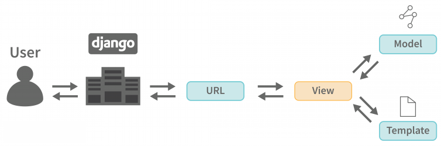

# Python Django 2021 Bootcamp Course Sessions

## Course Content

- Session #1: Views, URLs & Templates
- Session #2: Admin Panel, Models & Database Queries
- Session #3: Models Forms & CRUD
- Session #4: Static Files & Theme Installation



### Views, URLs & Templates

1. Start new project

   ```
   django-admin startproject devsearchlive .
   ```

   ```
    ├── devsearchlive
    │   ├── asgi.py
    │   ├── __init__.py
    │   ├── settings.py
    │   ├── urls.py
    │   └── wsgi.py
    ├── manage.py
    ├── README.md
    └── requirements.txt
   ```

2. Start new application

## Requirements

- Django==4.1.6
